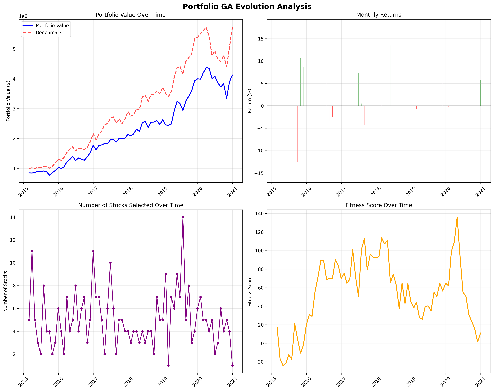

# Portfolio GA

This repository implements the Genetic Algorithm (GA)–based portfolio selection strategy described in Lim _et al._’s paper, "A Genetic Algorithm Approach to the Portfolio Selection Problem.

- **Rolling β calculation**
- **CAPM expected returns & mispricing**
- **Fitness function** combining Sharpe ratio and average mispricing
- **GA operators**: tournament selection, two‑point crossover, bit‑flip mutation, and elitism

---

## Algorithm Overview

1. **Data Preparation**

   - Load monthly stock and market price series.
   - Compute percentage returns and align indices.

2. **Rolling Beta (3‑Year Window)**

   - For each stock, compute βₙ = Cov(Rᵢ, Rₘ) / Var(Rₘ) over a rolling 36‑month window (minimum 12 months)

3. **CAPM Expected Return & Mispricing**

   - Compute expected return:
     E(Rᵢ) = R<sub>f,monthly</sub> + βᵢ · (E(Rₘ) – R<sub>f,monthly</sub>)
   - Mispricing = Actual – Expected average return over lookback period (default 12 months).

4. **Fitness Function**

   - Net returns subtract transaction fees (0.015%) and taxes (0.3%).
   - Sharpe component: (E\[R<sub>net</sub>] – R<sub>f</sub>) / σ<sub>net</sub>
   - Total fitness = Sharpe + average mispricing

5. **Genetic Algorithm**

   - **Initialization**: Random binary portfolios (1 to N stocks)
   - **Selection**: Tournament of size 3
   - **Crossover**: Two‑point at 100% rate
   - **Mutation**: Bit‑flip at 1% per gene, ensuring at least one stock
   - **Elitism**: Carry over top 2 individuals each generation
   - **Convergence**: Stop if no improvement for 20 generations.

6. **Backtesting**

   - Rebalance monthly over the specified period.
   - Apply GA to select portfolio each month.
   - Track portfolio value, returns, number of stocks, and fitness.

---

## Usage

```bash
pip install -r requirements.txt
python portfolio_ga.py
```

Configure parameters by editing the `GAParameters` and `MarketParameters` dataclasses. The main script demonstrates a backtest from 2015–01 to 2020–12 on 100 simulated stocks.

---

## Results

Below is an example of the portfolio’s evolution over time:



# Portfolio Performance Statistics

- **Total Return**: 312.68%
- **Annualized Return**: 27.07%
- **Volatility (Annual)**: 24.99%
- **Sharpe Ratio**: 1.090
- **Maximum Drawdown**: -23.53%
- **Win Rate**: 62.0%
- **Average Monthly Return**: 2.27%
- **Average Stocks Selected**: 5.1
- **Max Stocks Selected**: 14
- **Min Stocks Selected**: 1
